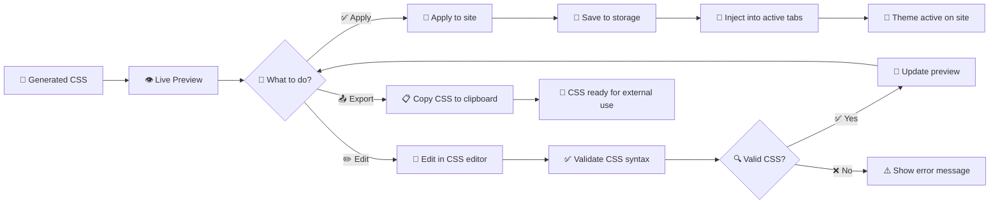

# sitecn Extension

A Chrome extension that provides Built-In Chrome AI (Google Gemini) powered theming assistance for a TweakCN-like experience on any website. Generate, Customize, Analyze and Inject or Preview shadcn-style CSS variable themes per domain.

<div align="center">
    
</div>

## Features

### Core Functionality

- **Local AI-Powered Theme Generation**: Uses Chrome's built-in LanguageModel API for on-device AI processing - No servers, no API keys, all local
- **Multiple Generation Modes**:
  - **Base Mode**: Freeform prompt
  - **Preset Mode**: Start with a registry theme
  - **Analyze Mode**: Site snapshot analysis
- **Real-time Preview**: Live CSS preview with immediate application to websites
- **Domain-specific Storage**: Themes are stored and managed per website domain
- **Chat Interface**: Conversational AI interface for theme refinement
- **Theme Export**: Copy generated CSS for external use
- **Settings Customization**: Configure AI model parameters
- 
### Technical Features

- **Chrome Side Panel**: Integrated side panel interface for seamless theming
- **Content Script Injection**: Automatic CSS injection without page refresh
- **Theme Registry Integration**: Access to TweakCN's curated theme collection
- **Responsive Design**: Mobile-optimized interface with adaptive layouts
- **Dark/Light Mode**: Built-in theme switching for the extension UI

## Quick Start

### Prerequisites

- Chrome 116+ (minimum version)
- Enable `chrome://flags/#prompt-api-for-gemini-nano` for AI features

### Installation

```bash
# Clone the repository
git clone https://github.com/BankkRoll/sitecn-extension.git
cd sitecn-extension

# Install dependencies
pnpm install

# Development
pnpm dev

# Build for production
pnpm build

# Build for Firefox (experimental)
pnpm build:firefox
```

## Browser Support

- Chrome 116+ ✅
- Edge 116+ ✅
- Firefox (experimental) ✅
- Other Chromium-based browsers ✅

## Development

### Available Scripts

```bash
pnpm install          # Install dependencies
pnpm dev              # Start development server
pnpm dev:firefox      # Start Firefox development server
pnpm build            # Build for production
pnpm build:firefox    # Build for Firefox
pnpm zip              # Create extension package
pnpm zip:firefox      # Create Firefox extension package
pnpm format           # Format codebase with Prettier
pnpm compile          # TypeScript compilation check
```

### Project Structure

<details>
 <summary>View it in action video</summary>

```
├── src/                             # Source code
│   ├── components/                  # React components
│   │   ├── sidepanel/              # Sidepanel-specific components
│   │   │   ├── editor/             # CSS editor interface
│   │   │   │   ├── css-editor.tsx  # CSS text editor
│   │   │   │   ├── footer-actions.tsx # Editor action buttons
│   │   │   │   └── live-preview.tsx # Live CSS preview
│   │   │   ├── home/               # Home view components
│   │   │   │   ├── chat/           # Chat interface
│   │   │   │   │   ├── base-theme-picker.tsx # Theme selection
│   │   │   │   │   ├── composer.tsx # Chat input
│   │   │   │   │   ├── inline-mode-badges.tsx # Mode indicators
│   │   │   │   │   ├── message.tsx # Individual messages
│   │   │   │   │   ├── messages.tsx # Message list
│   │   │   │   │   ├── mode-bar.tsx # Mode switching
│   │   │   │   │   └── theme-preview.tsx # Theme preview
│   │   │   │   ├── empty-chat.tsx  # Empty state
│   │   │   │   ├── model-footer.tsx # AI model status
│   │   │   │   └── starter-suggestions.ts # Quick prompts
│   │   │   ├── info/               # Information views
│   │   │   │   ├── readiness.tsx   # Setup readiness
│   │   │   │   └── troubleshoot.tsx # Troubleshooting guide
│   │   │   ├── settings/           # Settings interface
│   │   │   │   ├── model-settings.tsx # AI model configuration
│   │   │   │   └── theme-settings.tsx # Theme preferences
│   │   │   ├── header.tsx          # Sidepanel header
│   │   │   └── sidebar.tsx         # Navigation sidebar
│   │   ├── ui/                     # UI primitives (shadcn/ui)
│   │   ├── theme-provider.tsx      # Theme context provider
│   │   └── tweakcn-svg.tsx         # TweakCN logo SVG
│   ├── entrypoints/                # Extension entry points
│   │   ├── sidepanel/              # Sidepanel application
│   │   │   ├── views/              # Main view components
│   │   │   │   ├── editor.tsx      # CSS editor view
│   │   │   │   ├── home.tsx        # Home/chat view
│   │   │   │   ├── info.tsx        # Information view
│   │   │   │   └── settings.tsx    # Settings view
│   │   │   ├── App.tsx             # Main sidepanel app
│   │   │   ├── index.html          # HTML template
│   │   │   └── main.tsx            # Sidepanel entry point
│   │   ├── background.ts            # Background service worker
│   │   ├── main.css                # Global styles
│   │   └── types.ts                # TypeScript type definitions
│   ├── hooks/                      # Custom React hooks
│   │   └── use-mobile.tsx          # Mobile detection hook
│   └── lib/                        # Library utilities
│       ├── storage.ts              # Browser storage management
│       ├── system-prompt.ts        # AI system prompts
│       ├── theme-registry.ts       # Theme registry integration
│       └── utils.ts                # Utility functions
├── .gitignore                       # Git ignore patterns
├── components.json                  # shadcn/ui configuration
├── LICENSE                          # MIT License
├── package.json                     # Dependencies and scripts
├── pnpm-lock.yaml                  # Lockfile
├── postcss.config.js               # PostCSS configuration
├── tailwind.config.js              # Tailwind CSS configuration
├── tsconfig.json                   # TypeScript configuration
└── wxt.config.ts                   # WXT extension configuration
```

</details>

## Usage

### Basic Workflow

The extension provides three distinct modes for theme generation, each with its own workflow:

#### 1. Base Mode - Freeform Theme Generation

> **Basic Flow:** `Website` → `Sidepanel` → `Base Mode` → `Describe Theme` → `AI Generates CSS` → `Preview` → `Apply/Edit/Export`

#### 2. Preset Mode - Start from Registry Theme

> **Basic Flow:** `Website` → `Sidepanel` → `Preset Mode` → `Choose Registry Theme` → `Describe Changes` → `AI Adapts` → `Preview` → `Apply/Edit/Export`

#### 3. Analyze Mode - Current Style Analysis + Chat

> **Basic Flow:** `Website` → `Sidepanel` → `Analyze Mode` → `AI Snapshot` → `Style Analysis` → `Report` → `Propose Theme` → `Preview` → `Apply/Edit/Export/Chat`

### Theme Application Flow

> **Basic Flow:** `Generated CSS` → `Live Preview` → `Apply/Edit/Export` → `Validation` → `Storage` → `Injection`



## Troubleshooting

### Common Issues

- **Extension not loading**: Ensure Chrome 116+ and check extension permissions
- **AI not responding**: Verify `chrome://flags/#prompt-api-for-gemini-nano` is enabled
- **Themes not applying**: Check if the site allows content scripts
- **Build errors**: Ensure Node.js 18+ and pnpm are installed

### Getting Help

If you encounter issues not covered here:

1. Check the [Issues](https://github.com/BankkRoll/sitecn-extension/issues) page
2. Create a new issue with detailed error information
3. Include your Chrome version and extension version

## Contributing

We welcome contributions! Please follow these guidelines:

- Keep code typed and consistent (React + TypeScript, Tailwind, shadcn-style)
- On-device model only; avoid heavy motion libraries
- Submit pull requests with clear descriptions
- Ensure all tests pass before submitting

### Development Guidelines

- Use TypeScript for all new code
- Follow the existing code style and patterns
- Write clean, maintainable code
- Add appropriate documentation for new features
- Test changes across different Chrome versions

1. Fork the repo
2. Create feature branch: `git checkout -b feat/amazing-feature`
3. Commit changes: `git commit -m 'Add amazing feature'`
4. Push: `git push origin feat/amazing-feature`
5. Open Pull Request

## License

This project is licensed under the MIT License - see the [LICENSE](LICENSE) file for details.

## Acknowledgments

- Built with [WXT](https://wxt.dev/) for Chrome extension development
- UI components based on [shadcn/ui](https://ui.shadcn.com/)
- Powered by [TweakCN](https://tweakcn.com/) for default theme generation
- AI capabilities powered by [Chrome AI (Google Gemini)](https://ai.google.dev/)
- Styling with [Tailwind CSS](https://tailwindcss.com/)
- Icons from [Lucide React](https://lucide.dev/) and [React Icons](https://react-icons.github.io/react-icons/)
