# sitecn Extension

A Chrome extension that provides Built-In Chrome AI (Google Gemini) powered theming assistance for a TweakCN-like experience on any website. Generate, Customize, Analyze and Inject or Preview shadcn-style CSS variable themes per domain.

<div align="center">
    
    
</div>

## Features

### Core Functionality

- **Local AI-Powered Theme Generation**: Uses Chrome's built-in LanguageModel API for on-device AI processing - No servers, no API keys, all local
- **Multiple Generation Modes**:
  - **Base Mode**: Freeform custom theme creation from user descriptions
  - **Preset Mode**: Transform existing registry themes with custom modifications  
  - **Analyze Mode**: Intelligent site analysis with optimization suggestions
- **Real-time Preview**: Live CSS preview with immediate application to websites
- **Domain-specific Storage**: Themes are stored and managed per website domain
- **Chat Interface**: Conversational AI interface for theme refinement
- **Theme Export**: Copy generated CSS for external use
- **Settings Customization**: Configure AI model parameters

### Technical Features

- **Chrome Side Panel**: Integrated side panel interface for seamless theming
- **Content Script Injection**: Automatic CSS injection without page refresh
- **Theme Registry Integration**: Access to TweakCN's curated theme collection
- **Responsive Design**: Mobile-optimized interface with adaptive layouts
- **Dark/Light Mode**: Built-in theme switching for the extension UI
- **Advanced Style Extraction**: Comprehensive CSS analysis including CORS handling
- **Error Recovery**: Robust error handling with fallback mechanisms
- **Performance Optimization**: Caching, retry logic, and efficient DOM operations

## Quick Start

### Prerequisites

- Chrome 116+ (minimum version)
- Enable `chrome://flags/#prompt-api-for-gemini-nano` for AI features

### Installation

```bash
# Clone the repository
git clone https://github.com/BankkRoll/sitecn-extension.git
cd sitecn-extension

# Install dependencies
pnpm install

# Development
pnpm dev

# Build for production
pnpm build

# Build for Firefox (experimental)
pnpm build:firefox
```

## Browser Support

- Chrome 116+ ✅
- Edge 116+ ✅
- Firefox (experimental) ✅
- Other Chromium-based browsers ✅

## Development

### Available Scripts

```bash
pnpm install          # Install dependencies
pnpm dev              # Start development server
pnpm dev:firefox      # Start Firefox development server
pnpm build            # Build for production
pnpm build:firefox    # Build for Firefox
pnpm zip              # Create extension package
pnpm zip:firefox      # Create Firefox extension package
pnpm format           # Format codebase with Prettier
pnpm compile          # TypeScript compilation check
```

### Project Structure

<details>
 <summary>View it in action video</summary>

```
├── src/                             # Source code
│   ├── components/                  # React components
│   │   ├── sidepanel/              # Sidepanel-specific components
│   │   │   ├── editor/             # CSS editor interface
│   │   │   │   ├── css-editor.tsx  # CSS text editor
│   │   │   │   ├── footer-actions.tsx # Editor action buttons
│   │   │   │   └── live-preview.tsx # Live CSS preview
│   │   │   ├── home/               # Home view components
│   │   │   │   ├── chat/           # Chat interface
│   │   │   │   │   ├── base-theme-picker.tsx # Theme selection
│   │   │   │   │   ├── composer.tsx # Chat input
│   │   │   │   │   ├── inline-mode-badges.tsx # Mode indicators
│   │   │   │   │   ├── message.tsx # Individual messages
│   │   │   │   │   ├── messages.tsx # Message list
│   │   │   │   │   ├── mode-bar.tsx # Mode switching
│   │   │   │   │   └── theme-preview.tsx # Theme preview
│   │   │   │   ├── empty-chat.tsx  # Empty state
│   │   │   │   ├── model-footer.tsx # AI model status
│   │   │   │   └── starter-suggestions.ts # Quick prompts
│   │   │   ├── info/               # Information views
│   │   │   │   ├── readiness.tsx   # Setup readiness
│   │   │   │   └── troubleshoot.tsx # Troubleshooting guide
│   │   │   ├── settings/           # Settings interface
│   │   │   │   ├── model-settings.tsx # AI model configuration
│   │   │   │   └── theme-settings.tsx # Theme preferences
│   │   │   ├── header.tsx          # Sidepanel header
│   │   │   └── sidebar.tsx         # Navigation sidebar
│   │   ├── ui/                     # UI primitives (shadcn/ui)
│   │   ├── theme-provider.tsx      # Theme context provider
│   │   └── tweakcn-svg.tsx         # TweakCN logo SVG
│   ├── entrypoints/                # Extension entry points
│   │   ├── sidepanel/              # Sidepanel application
│   │   │   ├── views/              # Main view components
│   │   │   │   ├── editor.tsx      # CSS editor view
│   │   │   │   ├── home.tsx        # Home/chat view
│   │   │   │   ├── info.tsx        # Information view
│   │   │   │   └── settings.tsx    # Settings view
│   │   │   ├── App.tsx             # Main sidepanel app
│   │   │   ├── index.html          # HTML template
│   │   │   └── main.tsx            # Sidepanel entry point
│   │   ├── background.ts            # Background service worker
│   │   ├── main.css                # Global styles
│   │   └── types.ts                # TypeScript type definitions
│   ├── hooks/                      # Custom React hooks
│   │   └── use-mobile.tsx          # Mobile detection hook
│   └── lib/                        # Library utilities
│       ├── storage.ts              # Browser storage management
│       ├── system-prompt.ts        # AI system prompts
│       ├── theme-registry.ts       # Theme registry integration
│       └── utils.ts                # Utility functions
├── .gitignore                       # Git ignore patterns
├── components.json                  # shadcn/ui configuration
├── LICENSE                          # MIT License
├── package.json                     # Dependencies and scripts
├── pnpm-lock.yaml                  # Lockfile
├── postcss.config.js               # PostCSS configuration
├── tailwind.config.js              # Tailwind CSS configuration
├── tsconfig.json                   # TypeScript configuration
└── wxt.config.ts                   # WXT extension configuration
```

</details>

## Architecture Overview

### System Components

The extension consists of three main components that work together:

- **Background Script** (`background.ts`) - Service worker handling AI processing, storage, and message routing
- **Content Script** (`content.ts`) - Site style extraction and DOM manipulation  
- **Sidepanel UI** (`main.tsx`) - React-based interface for user interaction

### Mode Comparison

| Feature | Base Mode | Preset Mode | Analyze Mode |
|---------|-----------|-------------|--------------|
| **Input** | Custom prompt | Registry theme + modifications | Automatic site analysis |
| **AI Prompt** | `SYSTEM_PROMPT_BASE` | `SYSTEM_PROMPT_PRESET` | `SYSTEM_PROMPT_ANALYZE` |
| **Use Case** | Brand new themes | Adapt existing themes | Optimize current styles |
| **Output** | Fresh CSS design | Modified registry theme | Cleaned/improved CSS |
| **User Effort** | High (describe vision) | Medium (pick base + tweaks) | Low (automatic analysis) |

## Usage

### Complete Workflow

The extension provides three distinct modes for theme generation, each optimized for different use cases:

#### 1. Base Mode - Custom Theme Creation

```
User Input → Site Analysis → Custom AI Generation → CSS Output → Application
```

**Detailed Flow:**
1. **Navigation** - Open sidepanel, select "Base" mode
2. **Prompt Entry** - Describe your desired theme (e.g., "dark cyberpunk with neon accents")
3. **Site Extraction** - Content script analyzes current page styles via `document.styleSheets`
4. **AI Processing** - Background script uses `SYSTEM_PROMPT_BASE` with site context
5. **CSS Generation** - AI creates complete `:root` and `.dark` CSS variables
6. **Preview** - Live preview shows color swatches and theme tokens
7. **Application** - Apply directly to site or edit in CSS editor

#### 2. Preset Mode - Registry Theme Adaptation

```
Theme Selection → User Modifications → AI Adaptation → CSS Output → Application
```

**Detailed Flow:**
1. **Mode Selection** - Choose "Preset" mode in sidepanel
2. **Base Theme** - Select from 100+ curated themes via dropdown
3. **Customization** - Describe modifications (e.g., "make it warmer, add purple accents")
4. **Site Context** - Content script provides current page structure
5. **AI Transformation** - `SYSTEM_PROMPT_PRESET` adapts base theme to site + user requests
6. **CSS Output** - Maintains base theme characteristics while applying changes
7. **Application** - Preview and apply the adapted theme

#### 3. Analyze Mode - Intelligent Site Optimization

```
Automatic Analysis → AI Examination → Improvement Report → Optimized CSS → Application
```

**Detailed Flow:**
1. **Auto-trigger** - Select "Analyze" mode (automatically starts analysis)
2. **Deep Extraction** - Comprehensive style analysis including unused CSS detection
3. **AI Analysis** - `SYSTEM_PROMPT_ANALYZE` studies site design patterns
4. **Report Generation** - Detailed analysis of colors, typography, spacing, accessibility
5. **CSS Optimization** - Improved theme with better contrast, consistency, and performance
6. **Review & Apply** - Read analysis report and apply optimized theme

### Theme Application Flow

```mermaid
flowchart TD
    A[👤 User] --> B[🎨 Select Mode]
    B --> C{Mode Type?}
    
    C -->|Base| D[✏️ Write Custom Prompt]
    C -->|Preset| E[🎨 Choose Base Theme + Modify]
    C -->|Analyze| F[🔍 Auto-analyze Site]
    
    D --> G[📤 Send Request]
    E --> G
    F --> G
    
    G --> H[🌐 Extract Site Styles]
    H --> I[🤖 AI Processing]
    I --> J[📜 Generate CSS]
    J --> K[👁️ Preview Theme]
    K --> L{User Action?}
    
    L -->|✅ Apply| M[💾 Save to Domain]
    L -->|✏️ Edit| N[📝 CSS Editor]
    L -->|📤 Export| O[📋 Copy CSS]
    
    M --> P[💉 Inject to Site]
    N --> Q[🔄 Live Preview]
    Q --> L
```



## Troubleshooting

### Common Issues

#### Extension Setup
- **Extension not loading**: Ensure Chrome 116+ and check extension permissions
- **AI not responding**: Verify `chrome://flags/#prompt-api-for-gemini-nano` is enabled
- **Model unavailable**: Visit `chrome://on-device-internals` to check download status
- **Build errors**: Ensure Node.js 18+ and pnpm are installed

#### Theme Generation
- **Themes not applying**: Check if the site allows content scripts or has CSP restrictions
- **Empty CSS output**: AI model may need enabling - check model settings in Info tab
- **Slow generation**: Large sites require more processing time, especially on first analysis
- **CORS errors**: Extension automatically handles cross-origin stylesheets via background fetching

#### Performance Issues
- **Memory usage**: AI models require ~22GB disk space and 4GB+ VRAM for optimal performance
- **Slow extraction**: Complex sites with many stylesheets may take 10-15 seconds to analyze
- **Chat timeouts**: 60-second timeout prevents infinite waits - retry if needed

### Debug Mode

For development debugging, check browser console for detailed logs:
- Background script logs: Extension's service worker console
- Content script logs: Website's main console  
- Sidepanel logs: Extension popup's console

### Getting Help

If you encounter issues not covered here:

1. Check the [Issues](https://github.com/BankkRoll/sitecn-extension/issues) page
2. Create a new issue with detailed error information
3. Include your Chrome version and extension version

## Contributing

We welcome contributions! Please follow these guidelines:

- Keep code typed and consistent (React + TypeScript, Tailwind, shadcn-style)
- On-device model only; avoid heavy motion libraries
- Submit pull requests with clear descriptions
- Ensure all tests pass before submitting

### Development Guidelines

- **TypeScript First**: Use TypeScript for all new code with proper type definitions
- **React Patterns**: Follow React hooks and functional component patterns  
- **Message Types**: Add new message types to `types.ts` with proper payload interfaces
- **Error Handling**: Include comprehensive error handling with user feedback
- **Performance**: Consider on-device AI limitations and optimize for efficiency
- **Testing**: Test across different websites and Chrome versions
- **Documentation**: Document new features and update README accordingly

### Code Architecture Rules

- **Background Script**: Handle all AI processing, storage, and cross-tab coordination
- **Content Script**: Focus on DOM interaction and style extraction only
- **Sidepanel UI**: Pure React components with message passing to background
- **Storage**: Use domain-keyed storage for themes and settings
- **Error Recovery**: Always provide fallback mechanisms and user feedback

### Contribution Steps

1. Fork the repo
2. Create feature branch: `git checkout -b feat/amazing-feature`
3. Follow existing patterns in `background.ts`, `content.ts`, and React components
4. Test on multiple websites with different CSS frameworks
5. Commit changes: `git commit -m 'Add amazing feature'`
6. Push: `git push origin feat/amazing-feature`
7. Open Pull Request with detailed description

## License

This project is licensed under the MIT License - see the [LICENSE](LICENSE) file for details.

## Acknowledgments

- Built with [WXT](https://wxt.dev/) for Chrome extension development
- UI components based on [shadcn/ui](https://ui.shadcn.com/)
- Powered by [TweakCN](https://tweakcn.com/) for default theme generation
- AI capabilities powered by [Chrome AI (Google Gemini)](https://ai.google.dev/)
- Styling with [Tailwind CSS](https://tailwindcss.com/)
- Icons from [Lucide React](https://lucide.dev/) and [React Icons](https://react-icons.github.io/react-icons/)
